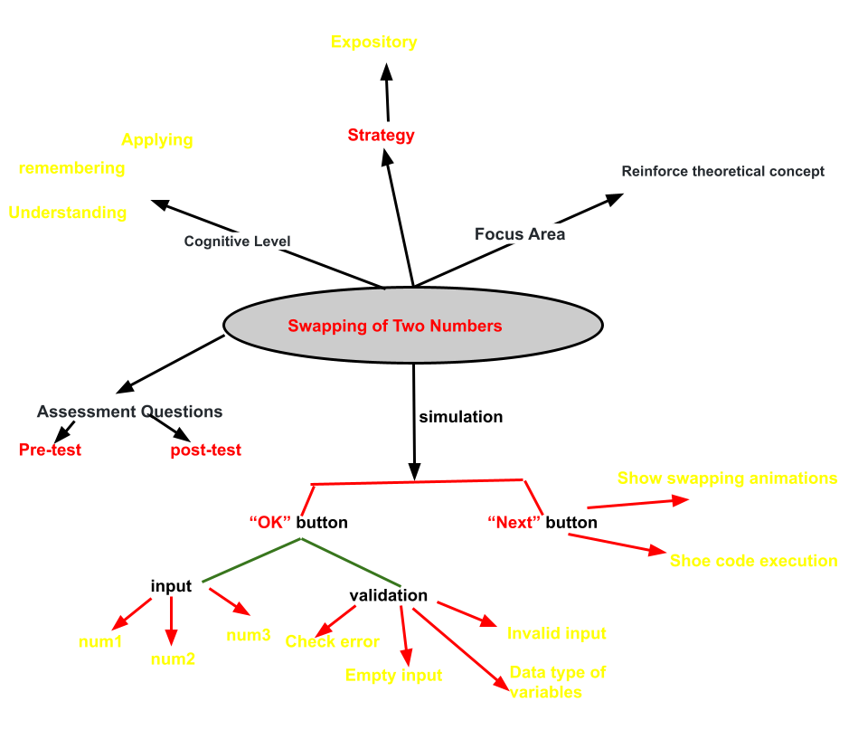
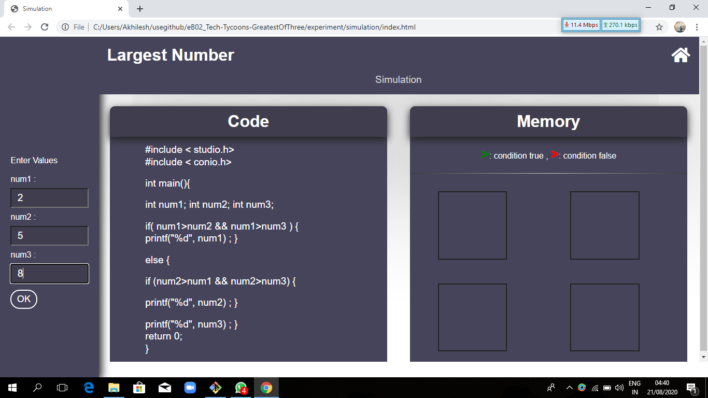
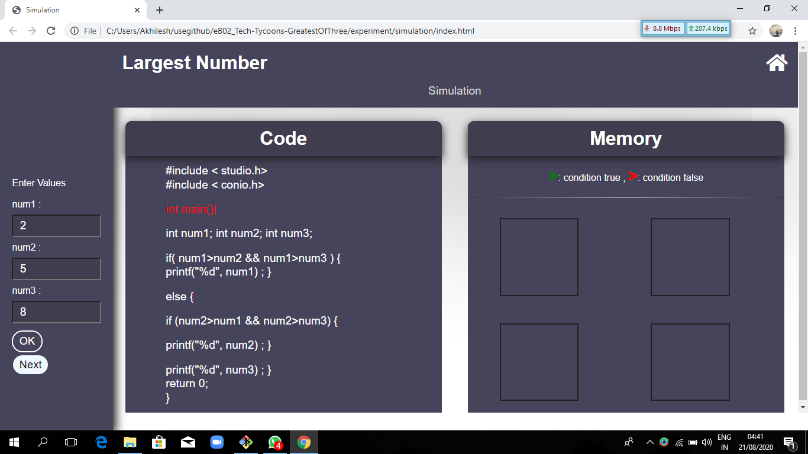
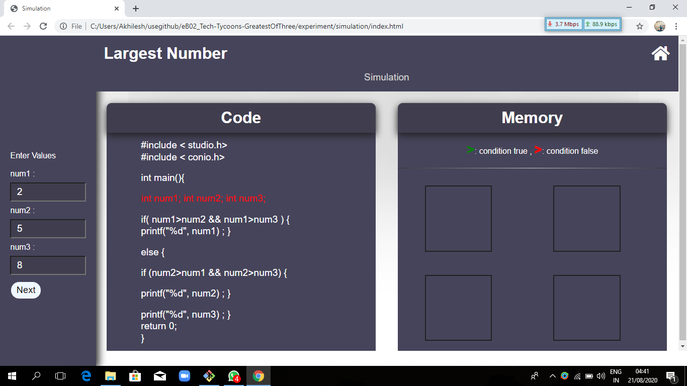
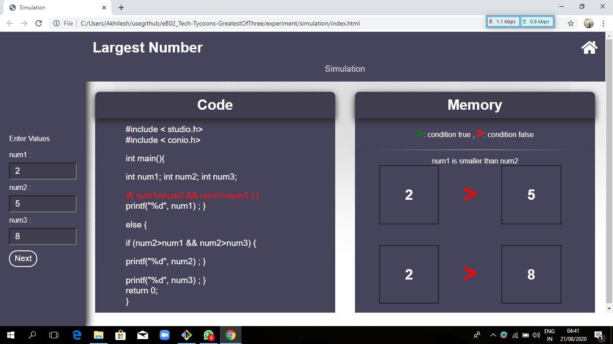
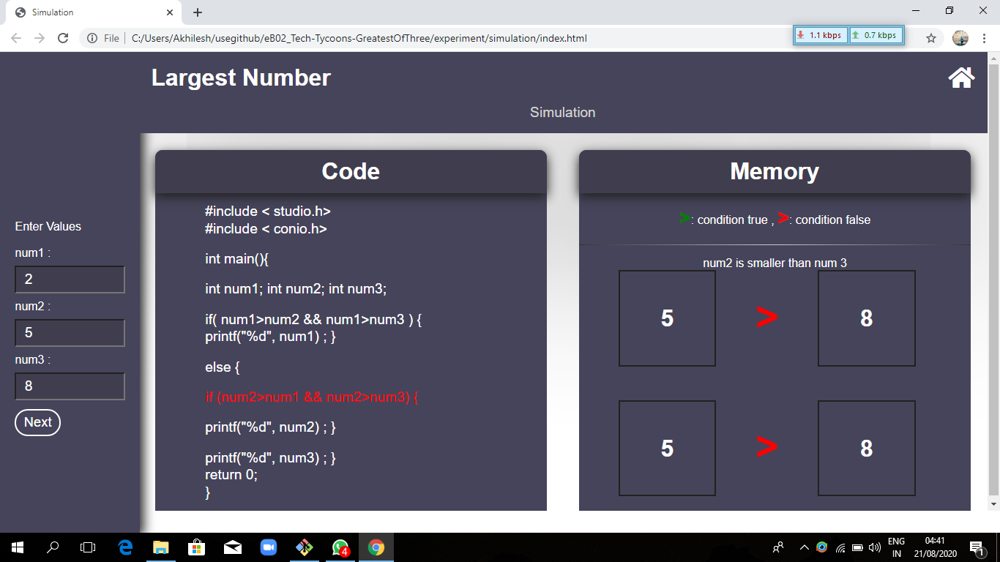
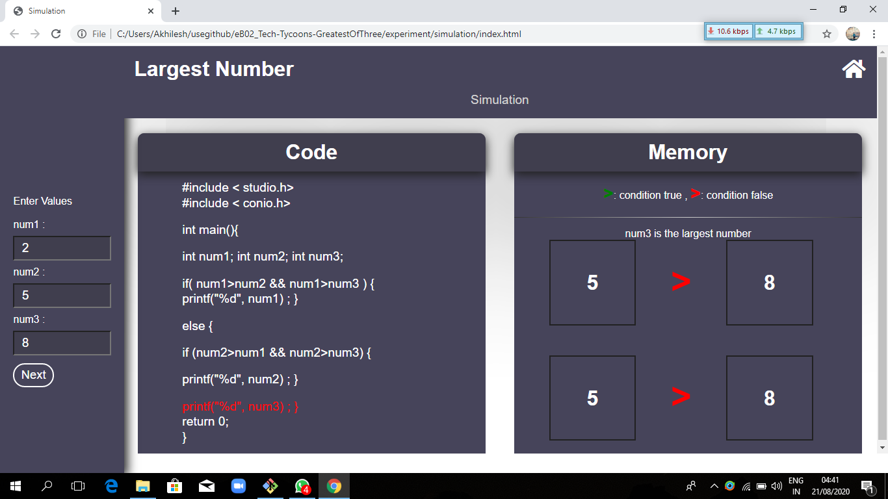

## Storyboard (Round 2)

Experiment 1: Write a program to found the greatest of three number.

### 1. Story Outline:

This experiment is based on finding the largest number from the given input of the user. The experiment will start by the input of user, User will have to give three numbers as a input. And the program will return the greatest number from the given input.

### 2. Story:

The term Greatest of three number itself decribes that it will find the greatest number from the inputs. Firstly, the program is going to compare two of its number and pick the largest from them. Then, it will compare that number to the third input number and find the largest amongst them. And this is how the program will return the greatest of three number.

#### 2.1 Set the Visual Stage Description:
Simulator consist of three blocks, at the left, the simulators asks for three inputs from the user. In the center, simulator will show the code related to the problem. And at the right side, simulator shows the memory block, where the user will be able to see how the program is going to be executed. After entering the three inputs, the user will have to press ok and the execution will start. And then the user will have to press next until the program finishes. Simulator will simulate the process of comparing those numbers in the memory block.  The "greater than symbol(>)" changes it's color to red and green describing which number is greater.

#### 2.2 Set User Objectives & Goals:
1. The main objective of the user is to get the largest number from three input numbers.
2. To get to know about how the algorithm of "Greatest of three numbers" works.
3. To understand how variables are compared.
4. User will need to answer some question based upon the experiment.

#### 2.3 Set the Pathway Activities:
01. User starts the simulator.
02. User will need to enter three number in the input box.
03. User will click on ok to start the execution.
04. Simulator will display the code of the problem in the code section.
05. Simulator will highlight the current line of code, where the compiler has reached.
06. User will press next button and simulator will compare first number to second and third number.
07. If comparision fails, then user will press next button, otherwise Final output will be displayed.
08. Simulator will then compare second number to first number and third number.
09. If comparision fails, then user will press next button, otherwise Final output will be displayed.
10. Then simulator will display the lagrest number as output.
11. Program finished.

##### 2.4 Set Challenges and Questions/Complexity/Variations in Questions:
Difficulty level : Remember 
Ques - What operator can be used at the place of if-else ladder? 
(a) Relational operator 
(b) Bitwise operator 
<b>(c) Ternary</b> 
(d) Logical operator 
Ques - What punctuation is used to signal the beginning and end of code blocks? 
(a) BEGIN and END 
<b>(b) { }</b> 
(c) ( and ) 
(d) -> and <- 
Ques - Which of the following is a correct comment? 
<b>(a) /* Comment */</b> 
(b) */ Comments */  
(c) ** Comment **  
(d) { Comment } 
Ques - Which of the following is the correct operator to compare two variables? 
(a) = 
<b>(b) ==</b> 
(c) := 
(d) equal 
Ques - Which of the following shows the correct syntax for an if statement? 
(a) if expression 
<b>(b) if ( expression )</b> 
(c) if { expression 
(d) expression if 

##### 2.5 Allow pitfalls:
There are pitfalls in the simulator, mentioned below:
1. User will get an error message if user presses ok without giving input.
2. User will get an error message if user enter string(alphabets or symbols) input.
3. User should not enter same values in the input field.

##### 2.6 Conclusion:
In this whole experiment, User will be able to learn and uderstand the algorithm of "Greatest of three numbers". This contains tasks separately to each learning objective mentioned by us. Generally, it will take almost half an hour to perform the experiment and to grasp the concept fully. Based on the successful completion of the experiment, user will be able to describe the greatest of three numbers. Hence with this, all the mentioned learning outcomes can be taken with the user.

##### 2.7 Equations/formulas: NA
if( num1>num2 && num1>num3 ) {

printf("%d", num1) ; }

else {

if (num2>num1 && num2>num3) {

printf("%d", num2) ; 
}

printf("%d", num3) ; 
}

### 3. Flowchart 4
 
link to flow chart Here : Store in the  /flowchart folder within Round2 folder in your repo
 
(guide :The lab proposer should extract logic from the story, prepare a flowchart from the story narration and write the algorithm to execute the black box.  use Google Drawings https://docs.google.com/drawings/ (send the link to your flowchart and also attach .png by exporting it )

### 4. Mindmap:

 Link to mindmap here : Store the mindmap in both .mm & .png extension in the  /mindmap folder and include link of only .pdf verison here
  
 (guide : An elaborate mind map (connecting all the points in the experiment flow ) should be prepared and submitted by the lab proposer. The mind map should be a clear and detailed document that takes into account all minute intri5acies involved in the development of virtual lab. The mindmap should be self-content and any developer across the globe should be able to code it with all those details. using only FreeMind http://freemind.sourceforge.net/wiki/index.php/Main_Page (send the .png file and also the original .mm extension project file. )

### 5. Storyboard :
 
 
 
 
 
 
 
