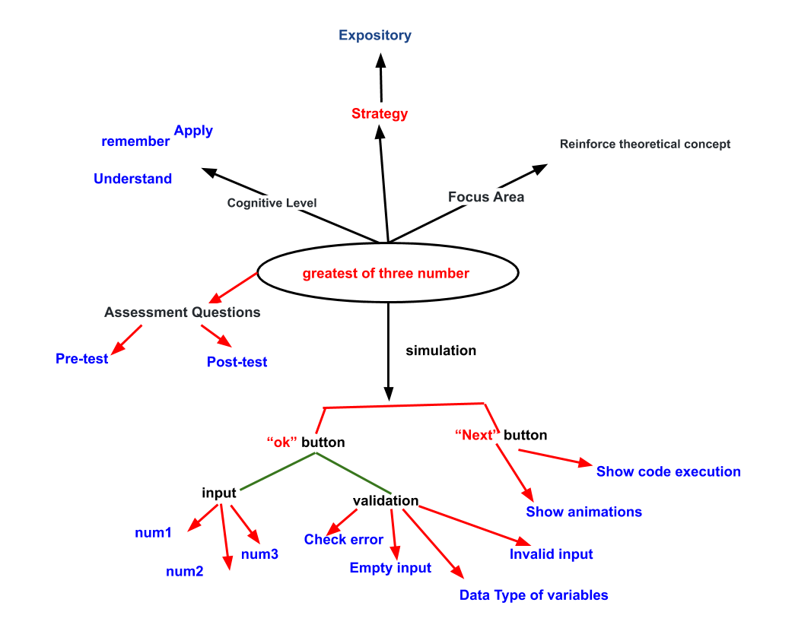

## Storyboard (Round 2)

Experiment 1: Write a program to find the greatest of three number.

### 1. Story Outline:

This experiment is based on finding the largest of three number given by the user. The user will enter three numbers then simulator will perform operation in intraction with user, and the program will return the greatest number from the given input.

### 2. Story:

The term greatest of three number itself describes that it will find the greatest number from the given inputs. Firstly, the program is going to compare two of it's numbers and pick the largest of them. Then, it will compare that number to the third number and find the largest among them. The simulator will show the greatest among three numbers.

#### 2.1 Set the Visual Stage Description:
Simulator consists of three blocks, at the left, the simulators asks for three inputs from the user. In the center, the simulator will show the code related to the problem and at the right side, simulator shows the memory block, where the user will be able to see how the program is going to be executed. After entering the three inputs, the user will have to press "OK" and the execution will start. And then the user will have to press "NEXT" until the program finishes. Simulator will simulate the process of comparing those numbers in the memory block.  The "greater than symbol(>)" changes it's color to red and green describing which number is greater.

#### 2.2 Set User Objectives & Goals:
1. The main objective of the user is to get the largest number from three input numbers.
2. To get to know about how the algorithm of "Greatest of three numbers" works.
3. To understand how variables are compared.
4. User will need to answer some question based upon the experiment.

#### 2.3 Set the Pathway Activities:
01. User starts the simulator.
02. User will need to enter three number in the input box.
03. User will click on ok to start the execution.
04. Simulator will display the code of the problem in the code section.
05. Simulator will highlight the current line of code, where the compiler has reached.
06. User will press next button and simulator will compare first number to second and third number.
07. If comparision fails, then user will press next button, otherwise Final output will be displayed.
08. Simulator will then compare second number to first number and third number.
09. If comparision fails, then user will press next button, otherwise Final output will be displayed.
10. Then simulator will display the lagrest number as output.
11. Program finished.

##### 2.4 Set Challenges and Questions/Complexity/Variations in Questions:
Difficulty level : Remember 
Ques1 - What operator can be used at the place of if-else ladder? 
(a) Relational operator 
(b) Bitwise operator 
<b>(c) Ternary operator</b> 
(d) Logical operator  
Ques2 - Punctuation used in function main() to signal the beginning and end of code blocks? 
(a) BEGIN and END 
<b>(b) { }</b> 
(c) ( and ) 
(d) -> and <-  
Ques3 - Which of the following is a correct comment? 
<b>(a) /* Comment */</b> 
(b) */ Comments */  
(c) ** Comment **  
(d) { Comment }  
Ques4 - Which of the following is the correct operator to compare two variables? 
(a) = 
<b>(b) ==</b> 
(c) := 
(d) equal  
Ques5 - Which of the following shows the correct syntax for an if statement? 
(a) if expression 
<b>(b) if ( expression ) {};</b> 
(c) if { expression 
(d) expression if 

##### 2.5 Allow pitfalls:
There are pitfalls in the simulator, mentioned below:
1. User will get an alert message, if user press ok without giving input.
2. User will get an alert message, if user enter string(alphabets or symbols) input.
3. User should not enter same values in the input field.

##### 2.6 Conclusion:
In this whole experiment, User will be able to learn and uderstand the algorithm of "Greatest of three numbers". This contains tasks separately to each learning objective. Approximately it will take half an hour to perform the experiment and to grasp the concept fully. At the successful completion of the experiment, user will be able to identify the greatest of three numbers.

##### 2.7 Equations/formulas: 
if( num1>num2 && num1>num3 ) {

printf("%d", num1) ; }

else {

if (num2>num1 && num2>num3) {

printf("%d", num2) ; 
}

printf("%d", num3) ; 
}

### 3. Flowchart 
 

### 4. Mindmap:

### 5. Storyboard :
 
 
 
 
 
 
 
 
 

